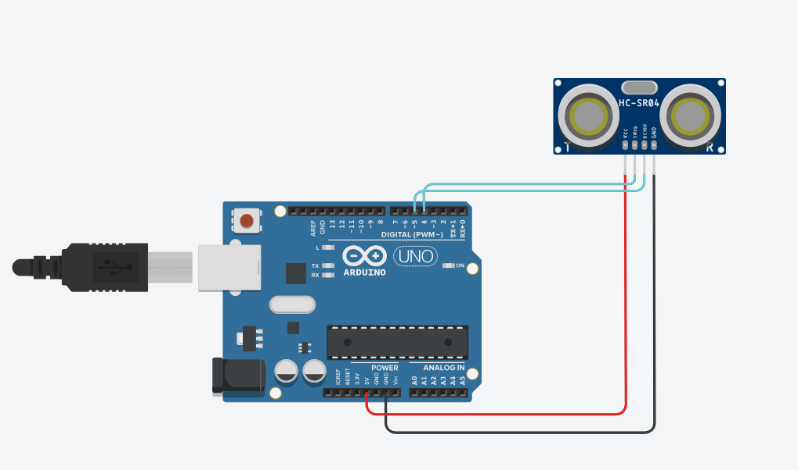
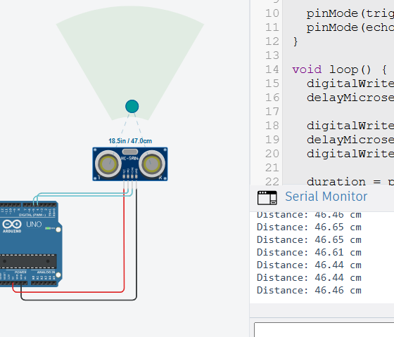
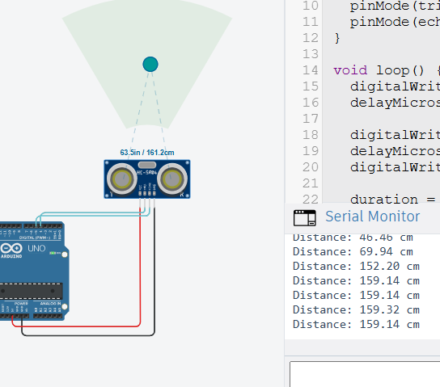

# Ultrasonic Sensor (HC-SR04)

## Circuit Preview



---

## 1. Sensor Type

The Ultrasonic Sensor is a **Digital sensor**
because it uses digital signals (HIGH / LOW).

---

## 2. Working Principle & Calculation

The sensor works based on:
**Sound Wave Reflection (Echo)**

### Formula:

Distance = (Speed × Time) / 2

In Arduino:
Distance = Time × 0.017

---

## 3. Datasheet & Voltage

* Operating Voltage: **5V**
* Measuring Range: **2 cm to 400 cm**

---

## 4. Pins & Connection

* VCC → 5V
* GND → GND
* TRIG → Pin 9
* ECHO → Pin 10

---

## 5. Arduino Code

```cpp
int trigPin = 9;
int echoPin = 10;

long duration;
float distance;

void setup() {
  Serial.begin(9600);
  pinMode(trigPin, OUTPUT);
  pinMode(echoPin, INPUT);
}

void loop() {
  digitalWrite(trigPin, LOW);
  delayMicroseconds(2);

  digitalWrite(trigPin, HIGH);
  delayMicroseconds(10);
  digitalWrite(trigPin, LOW);

  duration = pulseIn(echoPin, HIGH);

  distance = duration * 0.034 / 2;

  Serial.print("Distance: ");
  Serial.println(distance);

  delay(500);
}
```

---

## Circuit Serial Monitor




---

## 6. Project Purpose

* Distance measurement
* Parking sensors
* Obstacle detection
