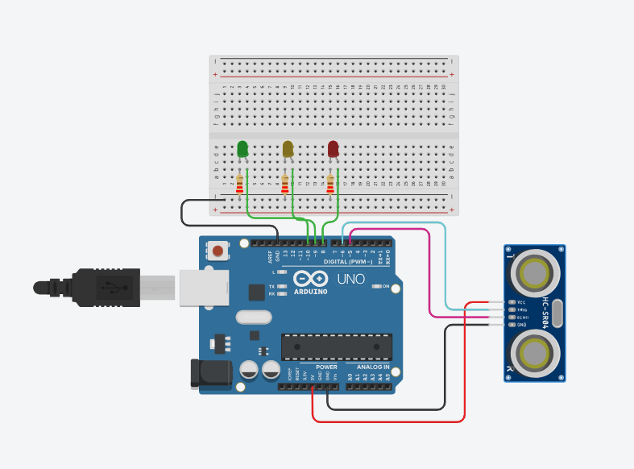
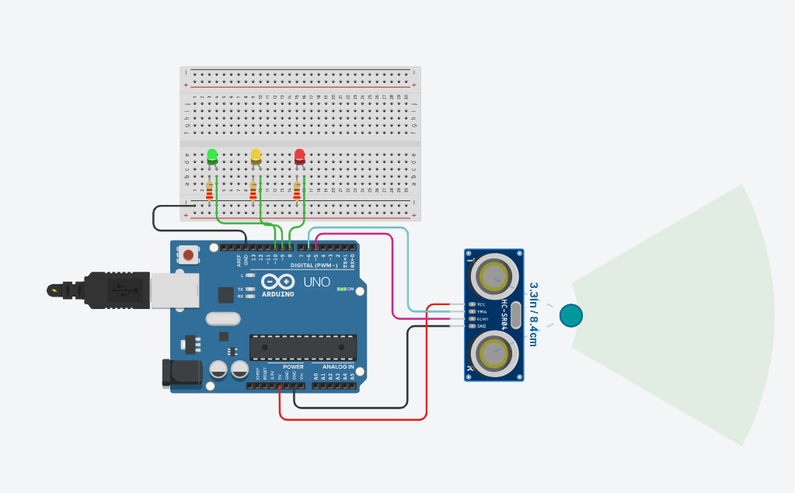
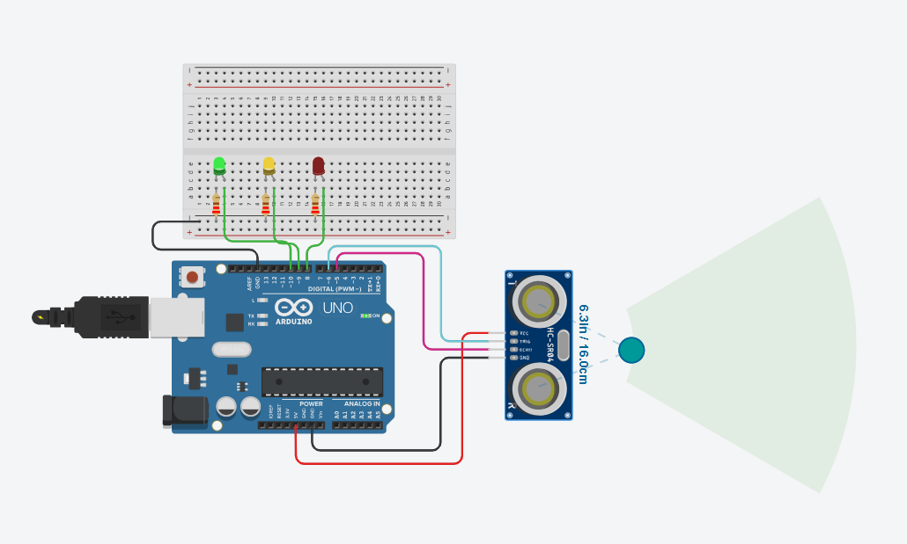
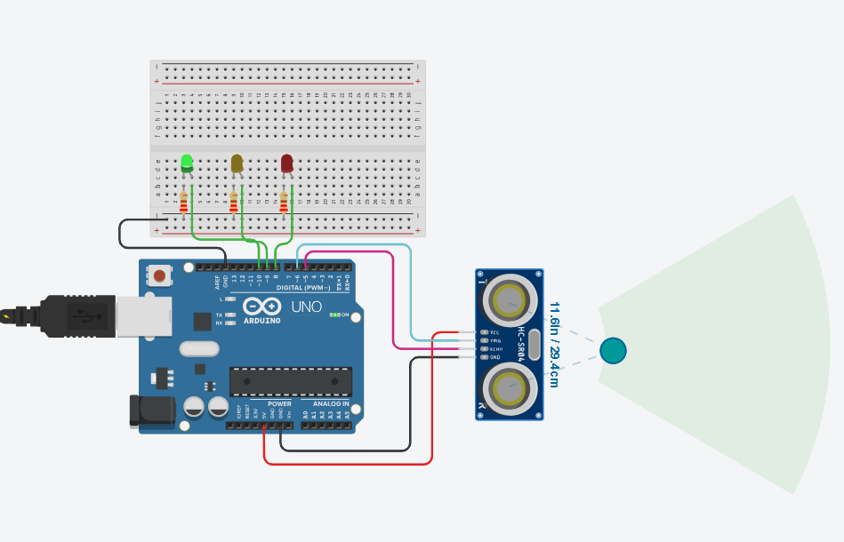

# Ultrasonic Sensor (HC-SR04)

## Circuit Preview

### Serial Monitor Setup


### Ultrasonic with LEDs



---

## Sensor Type

The Ultrasonic Sensor is a **Digital sensor**
because it uses digital signals (HIGH / LOW).

---

### Formula:

Distance = (Speed × Time) / 2

In Arduino:
Distance = Time × 0.017

---

## Datasheet & Voltage

* Operating Voltage: **5V**
* Measuring Range: **2 cm to 400 cm**

---

## Pins & Connection

* VCC → 5V
* GND → GND
* TRIG → Pin 6
* ECHO → Pin 5

---

## Circuit Implementation

* Connect the sensor and LEDs to Arduino
* Make sure all connections are correct
* Start simulation in Tinkercad

---

## Arduino Code (Serial Monitor)

```cpp id="c1"
int trigPin = 6;
int echoPin = 5;

long duration;
float distance;

void setup() {
  Serial.begin(9600);
  pinMode(trigPin, OUTPUT);
  pinMode(echoPin, INPUT);
}

void loop() {
  digitalWrite(trigPin, LOW);
  delayMicroseconds(2);

  digitalWrite(trigPin, HIGH);
  delayMicroseconds(10);
  digitalWrite(trigPin, LOW);

  duration = pulseIn(echoPin, HIGH);

  distance = duration * 0.034 / 2;

  Serial.print("Distance: ");
  Serial.println(distance);

  delay(500);
}
```

---

## Arduino Preview (Serial Monitor)


---

## Arduino Code (LED Control)

```cpp id="c2"
// C++ code
//
int val = 0;

long readUltrasonicDistance(int triggerPin, int echoPin)
{
  pinMode(triggerPin, OUTPUT);
  digitalWrite(triggerPin, LOW);
  delayMicroseconds(2);

  digitalWrite(triggerPin, HIGH);
  delayMicroseconds(10);
  digitalWrite(triggerPin, LOW);

  pinMode(echoPin, INPUT);

  return pulseIn(echoPin, HIGH);
}

void setup()
{
  Serial.begin(9600);
  pinMode(8, OUTPUT);
  pinMode(9, OUTPUT);
  pinMode(10, OUTPUT);
}

void loop()
{
  val = 0.01723 * readUltrasonicDistance(6, 5);

  Serial.println(val);

  if (val <= 10) {
    digitalWrite(8, HIGH);
  } else {
    digitalWrite(8, LOW);
  }

  if (val <= 20) {
    digitalWrite(9, HIGH);
  } else {
    digitalWrite(9, LOW);
  }

  if (val <= 30) {
    digitalWrite(10, HIGH);
  } else {
    digitalWrite(10, LOW);
  }

  delay(10);
}
```

---

## LED Behavior

* ≤ 10 cm → Red LED
* ≤ 20 cm → Yellow LED
* ≤ 30 cm → Green LED

---

## Arduino Preview (LED Behavior)





---

## Project Purpose

* Distance measurement
* Parking sensor simulation
* Obstacle detection system
